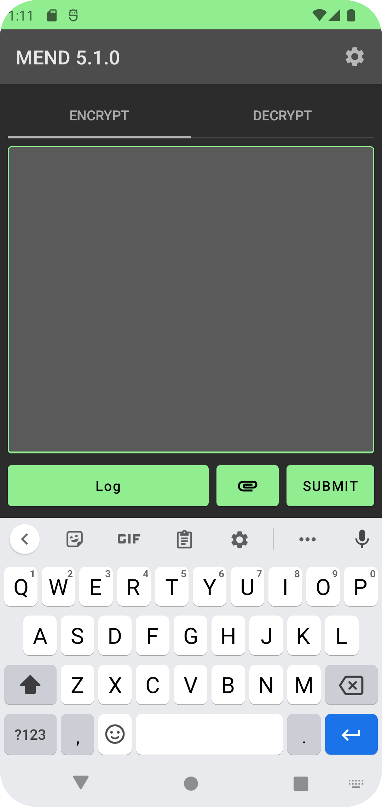

# MEND Android
You will need to read [the project README](../README.md) and have created a `config.xml` file using the setup process described in the [commandline application README](../desktop-mend/README.md) to use this app. You can build the app yourself or get the apk from the [releases page](https://github.com/SamAmco/MEND4/releases)
 

	
	
	
	
	
	
	

